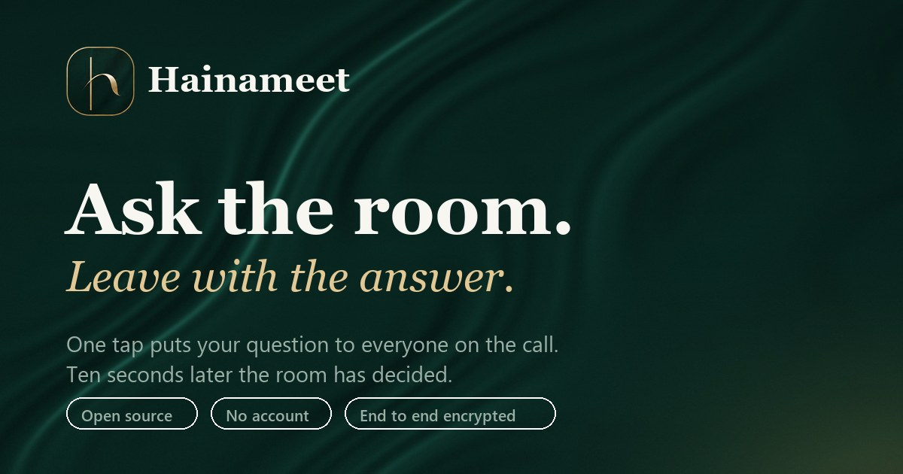

<div align="center">



**Video calls with a consensus button.**

Ask the room. Get `Haina`, `Na` or `Pata nahi` in ten seconds. Walk out with the receipts.

</div>

---

## What this is

It is a self-hostable video conferencing app built on [LiveKit](https://livekit.io), with one thing
no other meeting app has: a **consensus button**. Mid-sentence, you hit `haina?`, optionally type
what you are actually asking, and a countdown lands on every screen in the call. Everyone answers.
The tally fills in live. When the timer dies, the room gets a verdict and the decision is filed as a
**receipt** you can copy into any thread.

No agenda docs. No "let's take this offline". No follow-up email asking what was decided.

## The consensus loop

| Step         | What happens                                                                                                                      |
| ------------ | --------------------------------------------------------------------------------------------------------------------------------- |
| **Ask**      | One button, or `Ctrl/Cmd + Shift + H`. A question is optional. Windows of 10s, 20s or 45s.                                        |
| **Answer**   | Three choices: `Haina` (yes, agreed), `Na` (no, I disagree), `Pata nahi` (no opinion).                                            |
| **Verdict**  | Computed the moment the window closes, identical on every client, with commentary.                                                |
| **Receipts** | Every closed poll is filed with a timestamp, the tally and who asked. Copy them all as plain text, in the room or on the way out. |

It runs entirely over LiveKit's data channel. No extra backend, no database, nothing to deploy
beyond the app itself. Votes are keyed by participant identity, so double-tapping does not stuff the
ballot.

## Everything else

- Custom waiting room with live preview, real device pickers and a working mic meter
- Grid and spotlight stages, automatic focus on screen share, manual pin
- Chat, participant list, background blur and virtual backgrounds
- Reaction stamps that fly across the call
- Optional end-to-end encryption via a passphrase in the URL fragment
- Diagnostics overlay on `Shift + D` for bitrate, resolution and subscription state
- Room names that are actually memorable (`gilded-heron-4k2p`) instead of nine random digits
- No accounts. No sign-up. No tracking.

## Run it

You need a LiveKit server. The fastest path is a free [LiveKit Cloud](https://cloud.livekit.io)
project; a self-hosted server works exactly the same.

```bash
pnpm install
cp .env.example .env.local
```

Fill in `.env.local`:

```bash
LIVEKIT_API_KEY=your_key
LIVEKIT_API_SECRET=your_secret
LIVEKIT_URL=wss://your-project.livekit.cloud
NEXT_PUBLIC_SITE_URL=http://localhost:3000
```

Then:

```bash
pnpm dev
```

Open `http://localhost:3000`. Camera and microphone need either `localhost` or HTTPS; browsers will
not hand over devices on a plain-HTTP LAN address.

### Environment

| Variable                            | Required | What it does                                  |
| ----------------------------------- | -------- | --------------------------------------------- |
| `LIVEKIT_API_KEY`                   | yes      | Server-side key used to mint join tokens      |
| `LIVEKIT_API_SECRET`                | yes      | Server-side secret, never sent to the browser |
| `LIVEKIT_URL`                       | yes      | Your LiveKit websocket URL                    |
| `NEXT_PUBLIC_SITE_URL`              | no       | Canonical origin, used for link previews      |
| `NEXT_PUBLIC_CONN_DETAILS_ENDPOINT` | no       | Point token minting at a different service    |

### Deploy

It is a stock Next.js 15 app, so anything that runs Next works. On Vercel, set the three required
variables and ship. The token endpoint runs server-side, so the secret never reaches the client.

## How it fits together

```
app/
  page.tsx                      landing
  rooms/[roomName]/page.tsx     validates the slug, reads url options
  api/connection-details/       mints a short-lived LiveKit token
components/
  ui/                           wordmark and icon set
  home/                         landing and the join card
  prejoin/                      waiting room, preview, mic meter
  room/                         stage, dock, panels, consensus overlay
hooks/
  useHaina.ts                   the consensus protocol, client side
  usePreviewStream.ts           raw getUserMedia preview, no LiveKit coupling
  useE2EE.ts                    passphrase, worker and key provider
lib/
  haina.ts                      wire format, tallies, verdicts, receipts
  room-names.ts                 the slug generator
  room-options.ts               codec, simulcast and capture defaults
styles/
  tokens.css                    the entire design system, as variables
  globals.css                   the glass primitives and controls
  livekit.css                   LiveKit components mapped onto the same palette
```

## Design system

The surface language is deep emerald satin with brushed gold, read through layered glass. Three
things carry it, and all three live in `styles/`:

- **`tokens.css`** holds every colour, radius, blur, shadow and easing curve. Change `--gold` and
  the emerald ramp at the top and the entire app, LiveKit's own components included, retheme
  themselves.
- **`.pane`** in `globals.css` is the glass primitive: a translucent gradient fill, a saturating
  backdrop blur, an inset top highlight, layered ambient and key shadows, and a gradient hairline
  border drawn with `mask-composite` so the edge catches light on one side and gold on the other.
  `.pane-float` is the same thing one elevation higher.
- **`public/images/silk.jpg`** is the draped emerald backdrop the glass refracts. It is generated,
  not stock; regenerate or replace it and everything above it adapts.

Type is Cormorant Garamond for display, Manrope for interface, JetBrains Mono for codes and
timings, all self-hosted through `next/font`.

## Wire format

Consensus rides on one LiveKit data-channel topic, `haina`, as JSON:

```ts
{ k: 'ask',   id: string, by: string, q: string, ms: number }
{ k: 'vote',  id: string, c: 'haina' | 'na' | 'pata' }
{ k: 'stamp', s: string }
```

Clients derive the deadline from `ms` on arrival rather than trusting an absolute timestamp, so
clock skew between participants does not matter. Verdict commentary is picked by hashing the poll
id, which means every client independently lands on the same line without another round trip.

Late joiners do not see a poll that is already running. That is deliberate: the point is to capture
the room as it was when the question was asked.

## Security notes

Read this before pointing it at anything that matters.

- Anyone who can reach `/api/connection-details` can mint a token for any room name. That is fine
  for a personal deployment with unguessable slugs, and not fine for a product. Put your own auth in
  front of that route before you charge anyone money.
- End-to-end encryption is opt-in and lives entirely in the URL fragment (`#your-passphrase`).
  Fragments are never sent to the server. Share the link over a channel you trust, or the
  encryption is decorative.
- E2EE forces a codec fallback off AV1 and VP9, and rules out server-side recording.
- Tokens live for five minutes and only carry a grant for the one room requested.

## Contributing

Issues and pull requests are welcome. Before opening a PR:

```bash
pnpm typecheck
pnpm lint
pnpm test
pnpm format:write
```

Keep the design tokens as the single source of truth; if you find yourself writing a hex code
outside `styles/tokens.css`, there is probably a variable for it already.

## Credits

Originally forked from the [LiveKit Meet](https://github.com/livekit-examples/meet) example, which
is Apache-2.0. The realtime transport is LiveKit. Everything above the transport, including the
consensus protocol and the interface, is new.

Virtual background photographs are from [Unsplash](https://unsplash.com).

## License

MIT. See [LICENSE](LICENSE).
